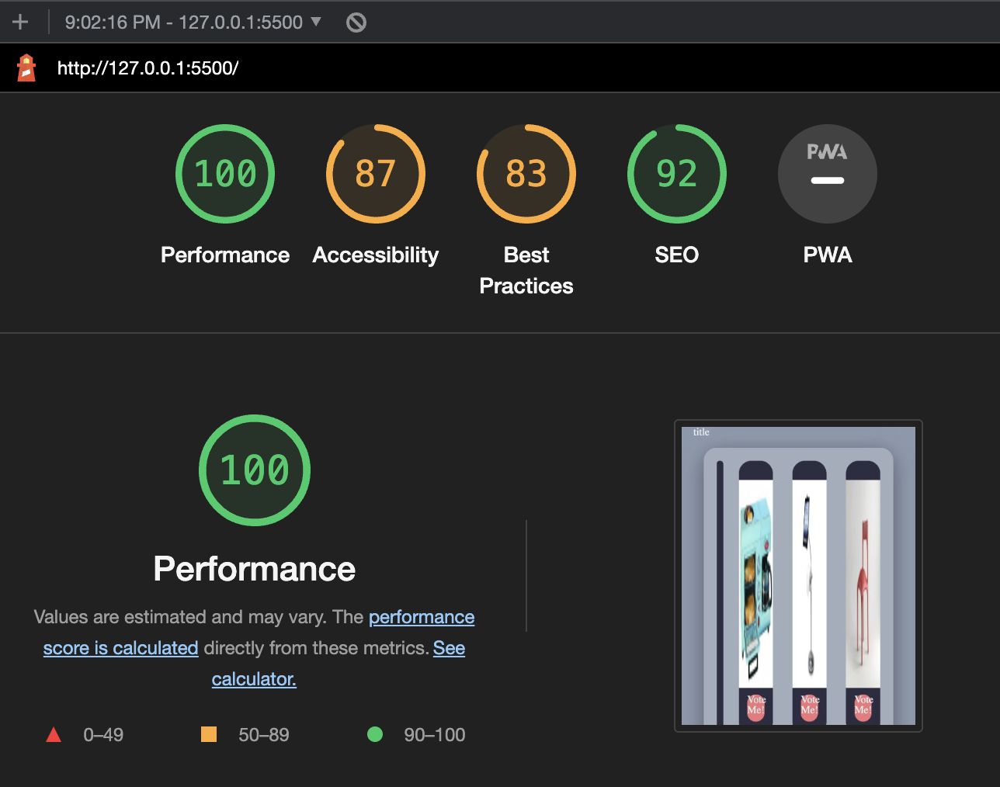

# odd-duck

## Odd duck products
This was a project in which we needed to display three unique products, all of which were not seen in the previous round of voting. The user would be able to vote for the product they found the best. After collecting the data , the results would appear as a graph below for easier reading. This uses local storage in order to store data from multiple sessions.

## Lighthouse Score

